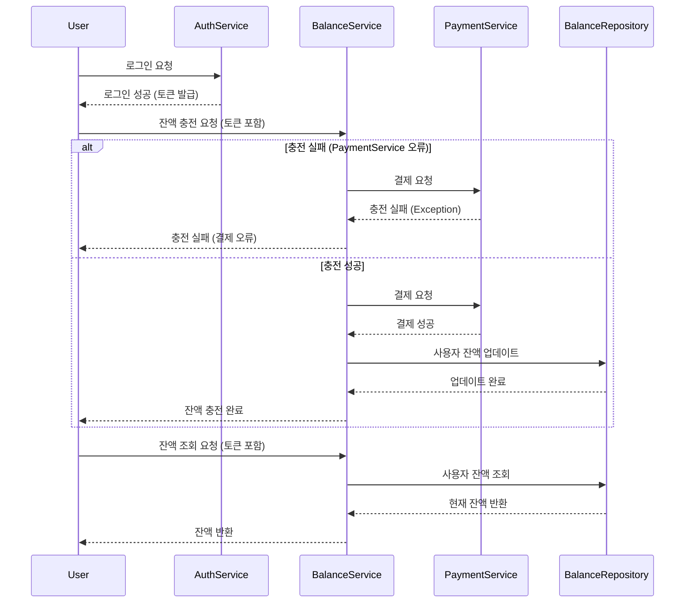
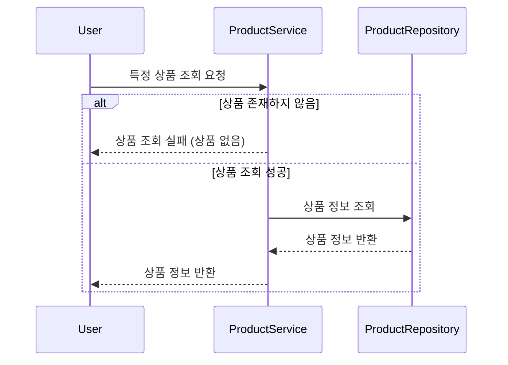
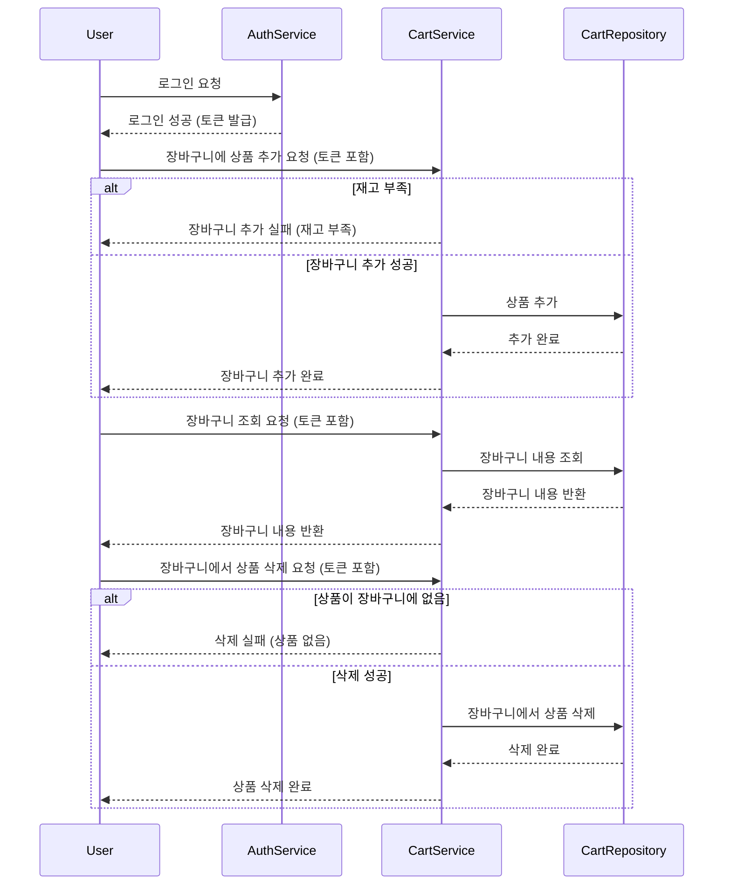
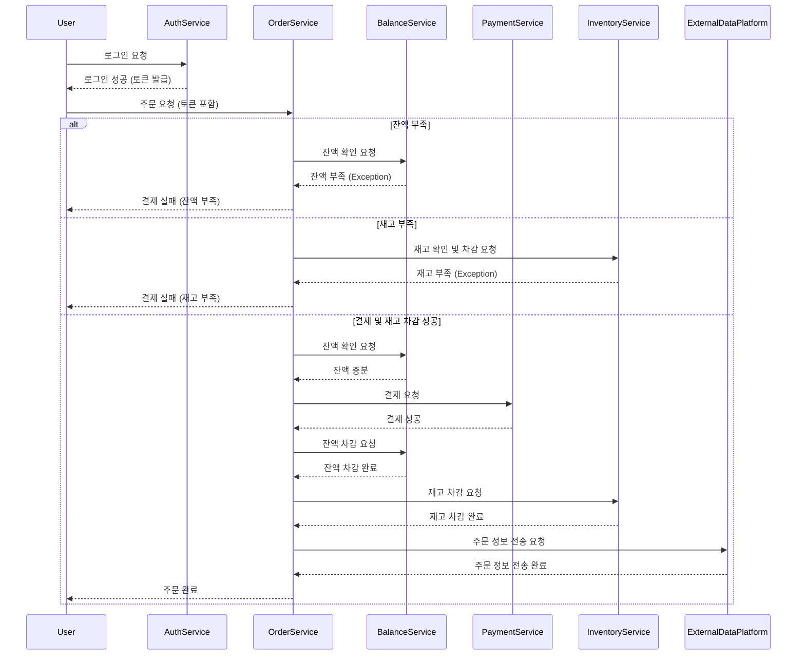
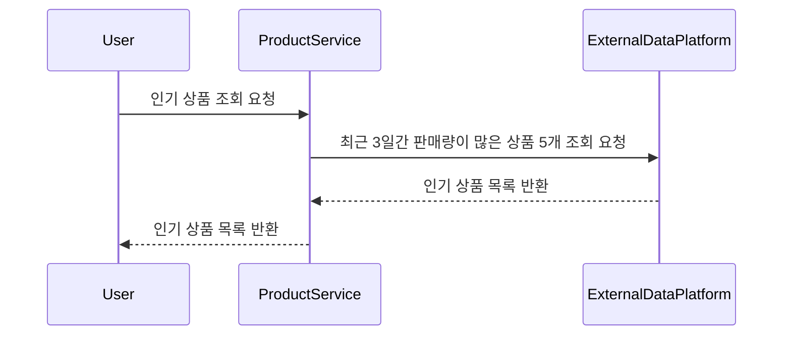

# 🛒 쇼핑몰 시스템
- 일반적인 커머스 시스템의 기본적인 기능들을 구현합니다. 
## 마일스톤

### 1주차: 설계 및 Mock API 구현
- **시퀀스 다이어그램 작성**: 각 API의 흐름을 시각화.
- **ERD 설계**: 데이터베이스 테이블 구조 설계.
- **Mock API 구현**: 아키텍처 설꼐 및 잔액, 상품, 주문 관련 Mock API 작성.

### 2주차: 잔액 충전/조회 API 및 상품 조회 API 구현
- **잔액 충전/조회 API**: 잔액 충전 및 조회 기능 구현.
- **상품 조회 API**: 상품 정보 및 잔여 수량 조회 기능 구현.
- **장바구니 기능 구현**: 장바구니에 상품 추가, 삭제 기능 구현.
- **단위 테스트 작성**: 두 API에 대한 테스트 작성.

### 3주차: 주문/결제 API, 인기 상품 조회 API 구현
- **주문/결제 API**: 주문 생성, 잔액 차감, 재고 차감 기능 구현.
- **인기 상품 조회 API**: 최근 3일간 가장 많이 팔린 상품 조회 기능 구현.
- **동시성 처리**: 다중 주문 처리 시 동시성 이슈 해결.

### 4주차:  최종 테스트
- **통합 테스트 및 최적화**: 전체 기능 연계 테스트 및 동시성 문제 해결.

------

## 시퀀스 다이어그램
* 참고 : 여기서 ~~ Service는 서비스 레이어를 뜻하는 것이 아니라 모듈이라고 생각해주세요. 
### 잔액 충전 및 조회 시퀀스 다이어그램



### 상품 조회 시퀀스 다이어그램


### 장바구니 기능 시퀀스 다이어그램



### 주문/결제 시퀀스 다이어그램



### 인기 상품 조회 시퀀스 다이어그램 


------

## ERD 설계 

erd 링크 [https://dbdiagram.io/d/6706abb897a66db9a36e4291]


- 11월 1일 기준으로 엔티티 일부가 변경되었습니다. ERD 와 동기화가 되어있지 않습니다.
------

## Mock API 구현

swagger로 대략적인 mock api를 문서화하였습니다.

http://localhost:8080/swagger-ui/index.html 에서 확인 가능합니다.

-------

## 그 외 정보

- **개발 환경**: Java 21, Spring Boot, JPA, H2 or MySQL, JUnit5, Mockito
- **프로젝트 구조**: 대략적인 패키지 구조는 다음과 같습니다. 
```
└── main
    └── java
        └── com.practice.commerce
            ├── api
            │   ├── controller         // API 컨트롤러 레이어, 각종 HTTP 요청을 처리
            │   ├── dto                // API 요청(Request)과 응답(Response)을 위한 DTO 클래스
            │   └── usecase            // 비즈니스 로직을 처리하는 유스케이스 레이어
            ├── common
            │   ├── config             // 전역 설정 클래스
            │   ├── dto                // 공통으로 사용하는 DTO 클래스
            │   ├── exception          // 예외 처리 관련 클래스
            │   └── logger             // 로그 관련 클래스
            ├── domain                 // 엔티티 및 도메인 관련 클래스를 하위에 작성할 예정입니다. 
            └── infrastructure         // 데이터베이스 및 외부 연동 관련 인프라스트럭처

```

---

## 동시성 관련 시나리오

### 개요

본 프로젝트에서는 Redis와 Redisson을 활용하여 사용자 잔액 처리 및 주문 생성과 같은 주요 비즈니스 로직에서 발생할 수 있는 **동시성 이슈**를 제어합니다.
특히, 다중 사용자가 동시에 주문을 생성할 때 **재고 부족, 잔액 부족** 등의 문제를 방지하기 위한 동시성 제어가 필요합니다.

### 동시성 이슈

다음 시나리오에서 동시성 문제가 발생할 수 있습니다:

1. **잔액 차감 및 재고 감소**: 다수의 사용자가 동시에 주문을 생성할 경우, 재고가 부족하거나 사용자 잔액이 충분하지 않음에도 불구하고 주문이 허용될 수 있습니다.
2. **중복 주문 처리 방지**: 하나의 주문에 대해 여러 번 잔액이 차감되거나 재고가 감소할 가능성이 있습니다.

### 동시성 제어 방식

본 프로젝트에서는 다음과 같은 동시성 제어 방식을 사용할 수 있습니다. 

### 3.1. Redis 분산 락

**적용 방법**: Redis의 분산 락을 사용하여 동시에 다수의 사용자로부터 주문이 들어오더라도 **락이 해제될 때까지 다른 작업이 수행되지 않도록 보장**합니다.

- **구현 복잡도**: 중간 수준. Redisson pub/sub lock 을 사용하여 Redis 락을 쉽게 적용할 수 있습니다.
- **성능**: 높은 성능. Redis는 인메모리 데이터베이스로서 높은 응답 속도를 제공하며, 락 해제 시 곧바로 다른 요청을 처리할 수 있습니다.
- **효율성**: Redis 락은 주문이 적은 경우에는 효율적이지만, 트래픽이 증가할 경우 락 획득 대기 시간이 증가할 수 있습니다.

**장점**:
- 여러 인스턴스에서 **동시성 제어가 가능**하며, Redis를 통해 상태를 관리하므로 별도의 DB 락보다 성능이 좋습니다.

**단점**:
- Redis 서버가 중단될 경우 락 해제 문제가 발생할 수 있으며, 네트워크 지연 시 락이 지연될 수 있습니다.
- SPoF(Single Point of Failure) 문제가 발생할 수 있습니다.

### 3.2. 데이터베이스 낙관적 락 (Optimistic Locking)

**적용 방법**: 낙관적 락을 사용하여 자원을 변경할 때마다 **버전 번호를 증가**시켜 갱신 충돌을 방지합니다.

- **구현 복잡도**: 낮음. JPA의 `@Version` 어노테이션을 통해 쉽게 적용 가능합니다.
- **성능**: 중간 수준. 읽기 성능에 유리하며, 충돌이 적을 경우 효과적입니다.
- **효율성**: 대부분의 트랜잭션이 충돌하지 않는 경우에 적합합니다.

**장점**:
- 트랜잭션 간의 충돌이 발생하지 않으면 성능에 큰 영향을 주지 않으며, 간단히 버전 번호만으로 충돌을 관리할 수 있습니다.

**단점**:
- 충돌이 잦은 경우 성능이 급격히 저하되며, 롤백이 빈번하게 발생할 수 있습니다.

### 3.3. 데이터베이스 비관적 락 (Pessimistic Locking)

**적용 방법**: 비관적 락을 사용하여 자원을 갱신할 때 **락을 걸어 다른 트랜잭션이 접근하지 못하도록 차단**합니다.

- **구현 복잡도**: 중간 수준. JPA의 `@Lock(LockModeType.PESSIMISTIC_WRITE)`를 통해 적용할 수 있습니다.
- **성능**: 낮음. 트랜잭션 대기 시간이 길어질 수 있으며, 갱신이 많은 경우 비효율적입니다.
- **효율성**: 충돌이 빈번한 경우에 적합하지만, 락 대기 시간이 증가할 수 있습니다.

**장점**:
- 동시성 제어가 확실히 보장되며, 충돌이 빈번한 경우에도 안정적입니다.

**단점**:
- **데드락**이 발생할 가능성이 있으며, 트랜잭션 지연 시간이 늘어납니다.
=> **성능 저하**가 발생할 수 있습니다.

### 선택한 동시성 제어 방식: Redis 분산 락 + 비관적 락

1. **Redis 락**을 통해 서버 간 동시성을 제어하고, 다중 서버 환경에서의 충돌을 방지합니다. -> 서버가 1대라는 가정이 없었으므로, 분산 락을 사용하여 서버 간 동시성을 제어합니다.
2. **DB 비관적 락**을 통해 데이터 갱신 시 다른 트랜잭션의 접근을 제한하여 **데이터 일관성을 보장**합니다.

### 구성 예시

1. Redis 락을 먼저 사용하여 **다른 서버로부터의 중복 접근을 방지**합니다.
2. 비관적 락을 통해 데이터 갱신 중 다른 트랜잭션의 접근을 차단합니다.
3. 락 해제 후, 주문 생성과 잔액 차감 작업이 모두 완료됩니다.

### 결론

Redis 분산 락과 비관적 락의 조합은 **서버 간 동시성 제어와 데이터 충돌 방지를 효과적으로 지원**합니다. 특히, 다중 서버 환경에서 **데이터의 일관성을 보장**하고 Redis 락을 통해 빠른 응답성과 효율성을 제공합니다.

---

## 성능 개선 로직 분석

캐시 적용 대상 분석 
- 이커머스 시나리오에서 성능 개선을 위한 대표적인 포인트는 주로 조회가 빈번하고, 변경이 적은 데이터입니다. 

### 1. 특정 상품 조회
- 캐시 적용 이유: 상품 개별 정보는 자주 조회되지만 변경 빈도는 상대적으로 낮습니다.
캐시 전략: 상품 ID를 키로 하여 Redis에 캐시하며, 캐시 만료 시간을 설정해 상품 정보가 업데이트될 때 갱신되도록 합니다.

### 2. 전체 상품 목록 조회
캐시 적용 이유: 전체 상품 목록 조회는 트래픽이 많은 경우가 많고, 데이터베이스 부하를 줄일 필요가 있습니다.
캐시 전략: 전체 상품 목록을 캐시하며, 주기적인 업데이트를 통해 최신 데이터를 반영할 수 있습니다.

### 3.인기 상품 목록 조회
캐시 적용 이유: 인기 상품 목록은 자주 조회되지만, 조회 결과가 일정 기간 동안 동일하게 유지될 가능성이 높습니다.
캐시 전략: 최근 3일간의 데이터를 기준으로 인기 상품을 캐시하고, 일정 주기로 갱신해 최신 인기 상품을 반영합니다.

