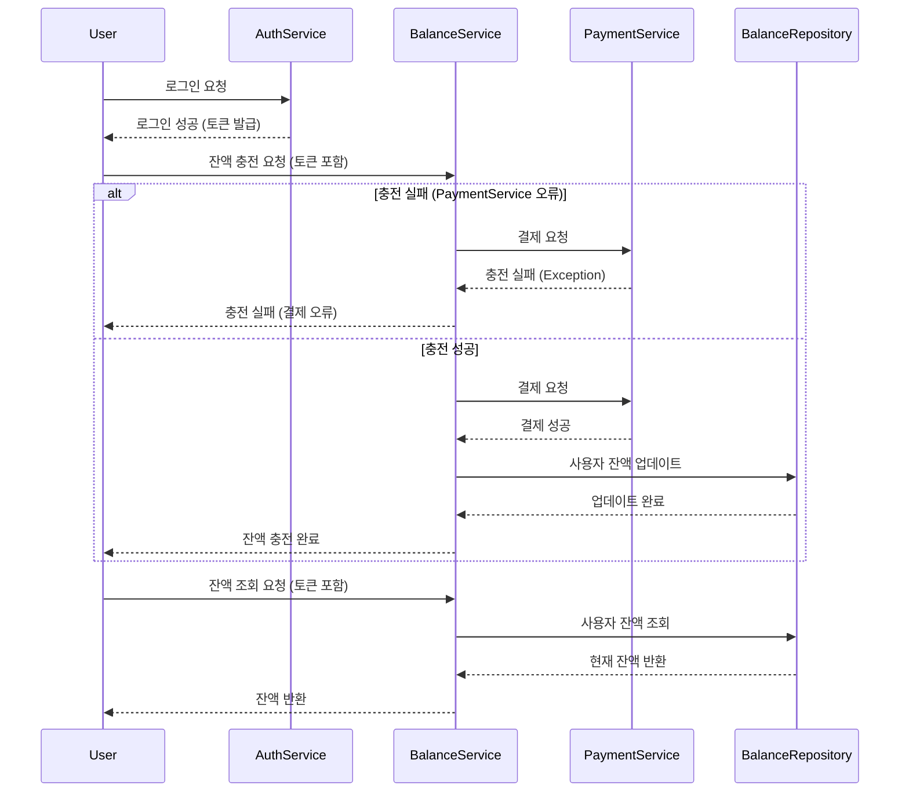
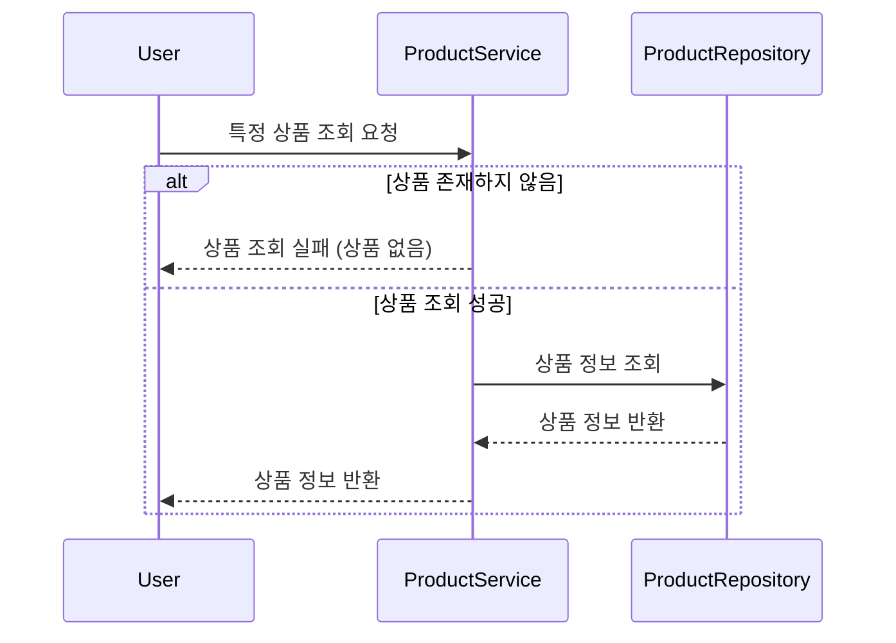
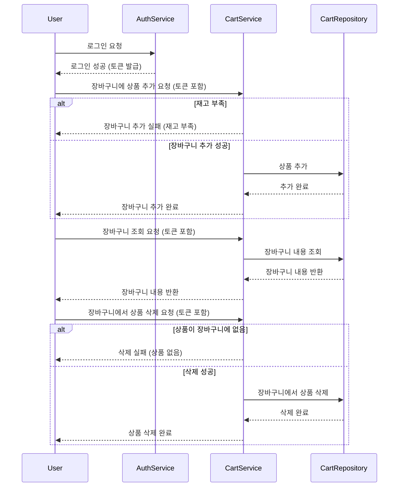
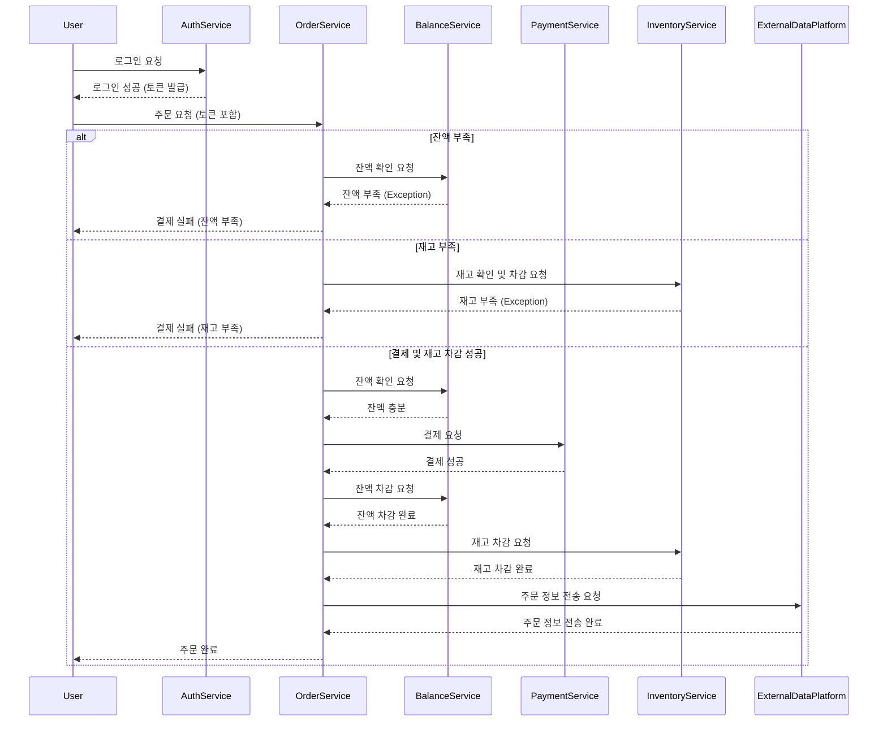
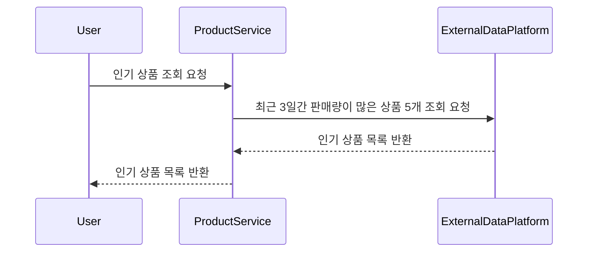

# 🛒 쇼핑몰 시스템
- 일반적인 커머스 시스템의 기본적인 기능들을 구현합니다. 
## 마일스톤

### 1주차: 설계 및 Mock API 구현
- **시퀀스 다이어그램 작성**: 각 API의 흐름을 시각화.
- **ERD 설계**: 데이터베이스 테이블 구조 설계.
- **Mock API 구현**: 아키텍처 설꼐 및 잔액, 상품, 주문 관련 Mock API 작성.

### 2주차: 잔액 충전/조회 API 및 상품 조회 API 구현
- **잔액 충전/조회 API**: 잔액 충전 및 조회 기능 구현.
- **상품 조회 API**: 상품 정보 및 잔여 수량 조회 기능 구현.
- **장바구니 기능 구현**: 장바구니에 상품 추가, 삭제 기능 구현.
- **단위 테스트 작성**: 두 API에 대한 테스트 작성.

### 3주차: 주문/결제 API, 인기 상품 조회 API 구현
- **주문/결제 API**: 주문 생성, 잔액 차감, 재고 차감 기능 구현.
- **인기 상품 조회 API**: 최근 3일간 가장 많이 팔린 상품 조회 기능 구현.
- **동시성 처리**: 다중 주문 처리 시 동시성 이슈 해결.

### 4주차:  최종 테스트
- **통합 테스트 및 최적화**: 전체 기능 연계 테스트 및 동시성 문제 해결.

------

## 시퀀스 다이어그램

### 잔액 충전 및 조회 시퀀스 다이어그램



### 상품 조회 시퀀스 다이어그램


### 장바구니 기능 시퀀스 다이어그램



### 주문/결제 시퀀스 다이어그램



### 인기 상품 조회 시퀀스 다이어그램 


------

## ERD 설계 

erd 링크 [https://dbdiagram.io/d/6706abb897a66db9a36e4291]


------

## Mock API 구현

swagger로 대략적인 mock api를 문서화하였습니다. 헤더에 멤버 토큰 정보를 넣는 기능을 각 api에 추가할 예정입니다. 

http://localhost:8080/swagger-ui/index.html 에서 확인 가능합니다.

-------

## 그 외 정보

- **개발 환경**: Java 21, Spring Boot, JPA, H2 or MySQL, JUnit5, Mockito
- **프로젝트 구조**: 대략적인 패키지 구조는 다음과 같습니다. 
```
└── main
    └── java
        └── com.practice.commerce
            ├── api
            │   ├── controller         // API 컨트롤러 레이어, 각종 HTTP 요청을 처리
            │   ├── dto                // API 요청(Request)과 응답(Response)을 위한 DTO 클래스
            │   └── usecase            // 비즈니스 로직을 처리하는 유스케이스 레이어
            ├── common
            │   ├── config             // 전역 설정 클래스
            │   ├── dto                // 공통으로 사용하는 DTO 클래스
            │   ├── exception          // 예외 처리 관련 클래스
            │   └── logger             // 로그 관련 클래스
            ├── domain                 // 엔티티 및 도메인 관련 클래스를 하위에 작성할 예정입니다. 
            └── infrastructure         // 데이터베이스 및 외부 연동 관련 인프라스트럭처

```
