# 🛒 쇼핑몰 시스템
- 일반적인 커머스 시스템의 기본적인 기능들을 구현합니다. 
## 마일스톤

### 1주차: 설계 및 Mock API 구현
- **시퀀스 다이어그램 작성**: 각 API의 흐름을 시각화.
- **ERD 설계**: 데이터베이스 테이블 구조 설계.
- **Mock API 구현**: 아키텍처 설꼐 및 잔액, 상품, 주문 관련 Mock API 작성.

### 2주차: 잔액 충전/조회 API 및 상품 조회 API 구현
- **잔액 충전/조회 API**: 잔액 충전 및 조회 기능 구현.
- **상품 조회 API**: 상품 정보 및 잔여 수량 조회 기능 구현.
- **장바구니 기능 구현**: 장바구니에 상품 추가, 삭제 기능 구현.
- **단위 테스트 작성**: 두 API에 대한 테스트 작성.

### 3주차: 주문/결제 API, 인기 상품 조회 API 구현
- **주문/결제 API**: 주문 생성, 잔액 차감, 재고 차감 기능 구현.
- **인기 상품 조회 API**: 최근 3일간 가장 많이 팔린 상품 조회 기능 구현.
- **동시성 처리**: 다중 주문 처리 시 동시성 이슈 해결.

### 4주차:  최종 테스트
- **통합 테스트 및 최적화**: 전체 기능 연계 테스트 및 동시성 문제 해결.

------

## 시퀀스 다이어그램

### 잔액 충전 및 조회 시퀀스 다이어그램

```mermaid
sequenceDiagram
    participant User
    participant AuthService
    participant BalanceService
    participant PaymentService
    participant BalanceRepository

    User ->> AuthService: 로그인 요청
    AuthService -->> User: 로그인 성공 (토큰 발급)

    User ->> BalanceService: 잔액 충전 요청 (토큰 포함)

    alt 충전 실패 (PaymentService 오류)
        BalanceService ->> PaymentService: 결제 요청
        PaymentService -->> BalanceService: 충전 실패 (Exception)
        BalanceService -->> User: 충전 실패 (결제 오류)
    else 충전 성공
        BalanceService ->> PaymentService: 결제 요청
        PaymentService -->> BalanceService: 결제 성공
        BalanceService ->> BalanceRepository: 사용자 잔액 업데이트
        BalanceRepository -->> BalanceService: 업데이트 완료
        BalanceService -->> User: 잔액 충전 완료
    end

    User ->> BalanceService: 잔액 조회 요청 (토큰 포함)
    BalanceService ->> BalanceRepository: 사용자 잔액 조회
    BalanceRepository -->> BalanceService: 현재 잔액 반환
    BalanceService -->> User: 잔액 반환

```

### 상품 조회 시퀀스 다이어그램

```mermaid
sequenceDiagram
    participant User
    participant ProductService
    participant ProductRepository

    User ->> ProductService: 특정 상품 조회 요청

    alt 상품 존재하지 않음
        ProductService -->> User: 상품 조회 실패 (상품 없음)
    else 상품 조회 성공
        ProductService ->> ProductRepository: 상품 정보 조회
        ProductRepository -->> ProductService: 상품 정보 반환
        ProductService -->> User: 상품 정보 반환
    end
```

### 장바구니 기능 시퀀스 다이어그램

```mermaid
sequenceDiagram
    participant User
    participant AuthService
    participant CartService
    participant CartRepository

    User ->> AuthService: 로그인 요청
    AuthService -->> User: 로그인 성공 (토큰 발급)

    User ->> CartService: 장바구니에 상품 추가 요청 (토큰 포함)

    alt 재고 부족
        CartService -->> User: 장바구니 추가 실패 (재고 부족)
    else 장바구니 추가 성공
        CartService ->> CartRepository: 상품 추가
        CartRepository -->> CartService: 추가 완료
        CartService -->> User: 장바구니 추가 완료
    end

    User ->> CartService: 장바구니 조회 요청 (토큰 포함)
    CartService ->> CartRepository: 장바구니 내용 조회
    CartRepository -->> CartService: 장바구니 내용 반환
    CartService -->> User: 장바구니 내용 반환

    User ->> CartService: 장바구니에서 상품 삭제 요청 (토큰 포함)

    alt 상품이 장바구니에 없음
        CartService -->> User: 삭제 실패 (상품 없음)
    else 삭제 성공
        CartService ->> CartRepository: 장바구니에서 상품 삭제
        CartRepository -->> CartService: 삭제 완료
        CartService -->> User: 상품 삭제 완료
    end
```

### 주문/결제 시퀀스 다이어그램

```mermaid
sequenceDiagram
    participant User
    participant AuthService
    participant OrderService
    participant BalanceService
    participant PaymentService
    participant InventoryService
    participant ExternalDataPlatform

    User ->> AuthService: 로그인 요청
    AuthService -->> User: 로그인 성공 (토큰 발급)

    User ->> OrderService: 주문 요청 (토큰 포함)

    alt 잔액 부족
        OrderService ->> BalanceService: 잔액 확인 요청
        BalanceService -->> OrderService: 잔액 부족 (Exception)
        OrderService -->> User: 결제 실패 (잔액 부족)
    else 재고 부족
        OrderService ->> InventoryService: 재고 확인 및 차감 요청
        InventoryService -->> OrderService: 재고 부족 (Exception)
        OrderService -->> User: 결제 실패 (재고 부족)
    else 결제 및 재고 차감 성공
        OrderService ->> BalanceService: 잔액 확인 요청
        BalanceService -->> OrderService: 잔액 충분
        OrderService ->> PaymentService: 결제 요청
        PaymentService -->> OrderService: 결제 성공
        OrderService ->> BalanceService: 잔액 차감 요청
        BalanceService -->> OrderService: 잔액 차감 완료
        OrderService ->> InventoryService: 재고 차감 요청
        InventoryService -->> OrderService: 재고 차감 완료
        OrderService ->> ExternalDataPlatform: 주문 정보 전송 요청
        ExternalDataPlatform -->> OrderService: 주문 정보 전송 완료
        
        OrderService -->> User: 주문 완료

    end


```

### 인기 상품 조회 시퀀스 다이어그램 

```mermaid
sequenceDiagram
    participant User
    participant ProductService
    participant ExternalDataPlatform

    User ->> ProductService: 인기 상품 조회 요청
    ProductService ->> ExternalDataPlatform: 최근 3일간 판매량이 많은 상품 5개 조회 요청
    ExternalDataPlatform -->> ProductService: 인기 상품 목록 반환
    ProductService -->> User: 인기 상품 목록 반환
```

------

## ERD 설계 

erd 링크 [https://dbdiagram.io/d/6706abb897a66db9a36e4291]

